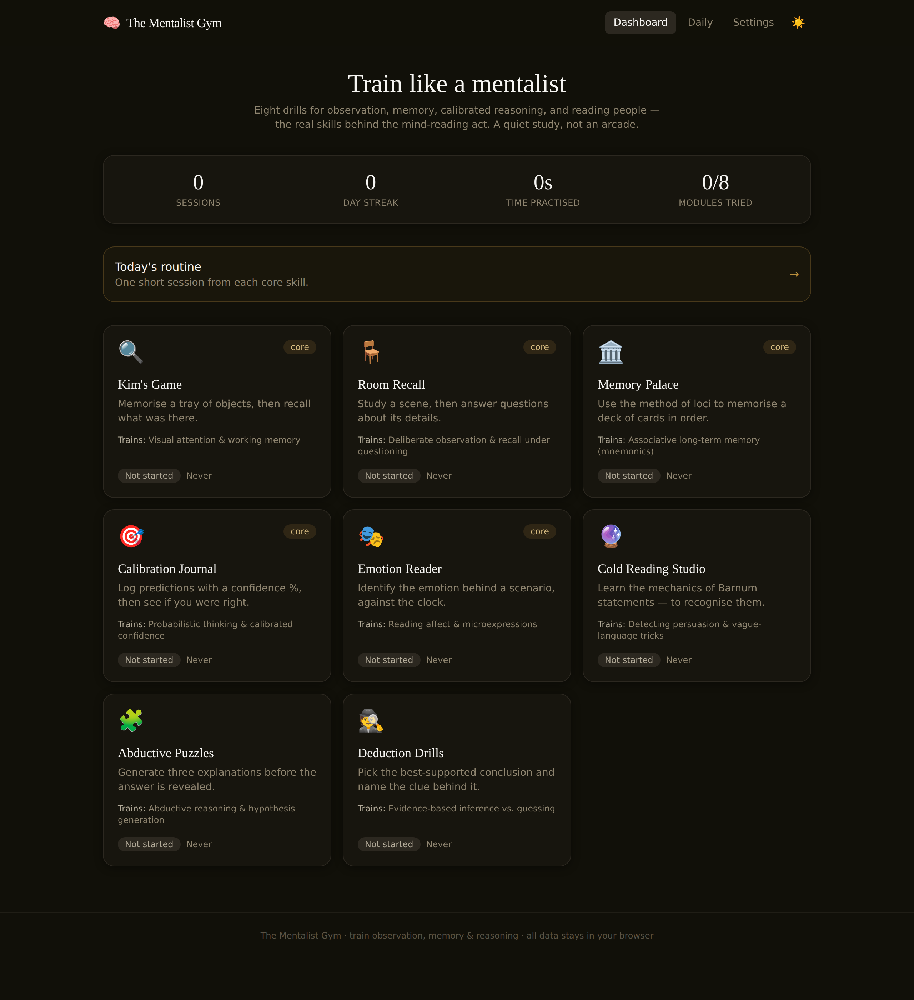
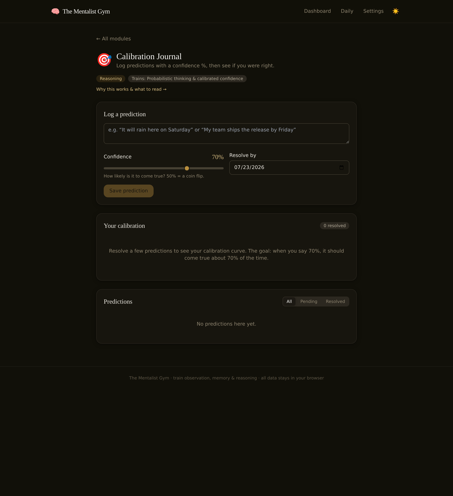

# 🧠 The Mentalist Gym

A training suite of interactive games for developing the real skills behind the
"mind-reading" act — **observation, memory, calibrated reasoning, people-reading,
and abductive inference**. Inspired by the toolkit of characters like Patrick
Jane and real mentalists like Derren Brown, but grounded in actual cognitive
science rather than showmanship.

It's a static single-page app: **no backend, no accounts, no tracking.** All your
scores, streaks, journal entries, and memory palaces live in your browser's
`localStorage`, and you can export/import everything as a JSON file.

> A quiet study, not a neon arcade.

---

## What it trains

Each module maps to a genuine, transferable skill:

| Module | Real skill it trains |
| --- | --- |
| 🔍 **Kim's Game** | Visual attention & working memory |
| 🪑 **Room Recall** | Deliberate observation & recall under questioning |
| 🏛️ **Memory Palace** | Associative long-term memory (method of loci + PAO) |
| 🎯 **Calibration Journal** | Probabilistic thinking & calibrated confidence |
| 🎭 **Emotion Reader** | Reading affect & microexpressions |
| 🔮 **Cold Reading Studio** | Recognising Barnum statements & persuasion tricks |
| 🧩 **Abductive Puzzles** | Hypothesis generation ("don't fall for your first theory") |
| 🕵️ **Deduction Drills** | Evidence-based inference vs. guessing |

Every module carries a short **"why this works"** note and a recommended book
(Konnikova's *Mastermind*, Foer's *Moonwalking with Einstein*, Tetlock's
*Superforecasting*, Kahneman's *Thinking, Fast and Slow*, Ekman's *Emotions
Revealed*, Rowland's cold-reading book, and more).

### The centrepiece: the Calibration Journal

The most important trainer. You log a prediction, assign a **confidence %**, and
a resolution date; later you mark it True or False. The app then plots your
**calibration curve** — stated confidence vs. actual hit-rate — so you can see
whether your "70% sure" guesses really come true about 70% of the time, and
reports a **Brier score**. This is the core "think in probabilities" habit that
separates good forecasters from confident ones.

---

## Features

- **8 fully-playable modules**, each seeded with content so there's zero setup.
- **Scoring, best scores, and per-emotion / calibration breakdowns.**
- **Daily streak system** 🔥 and a **daily routine** that queues one short session
  from each core skill.
- **Per-module settings** (difficulty, timers) that persist.
- **Export / Import** all data as JSON, plus a guarded **reset**.
- **Schema-versioned storage** so future updates migrate your data instead of
  wiping it.
- **Dark / light themes**, fully **responsive** (phone + desktop), and
  **keyboard-accessible**.

---

## Screenshots

| Dashboard | Calibration Journal |
| --- | --- |
|  |  |

> _Add more captures to `docs/` as you build out your own routine._

---

## Tech stack

- **React 18** + **TypeScript** (strict)
- **Vite** for dev/build
- **Tailwind CSS** for styling
- **React Router** (HashRouter, so it works on any static host)
- No runtime backend; SVG charts are hand-drawn (no chart library).

### Architecture

Each training module is a self-contained folder under `src/modules/<module>/`
with its own logic and data. Adding a new module takes three steps:

1. Create the component under `src/modules/<your-module>/`.
2. Add its metadata to `src/lib/registry.ts`.
3. Register the lazy import in `src/modules/index.ts`.

```
src/
├── components/      # shared UI (Panel, Button, TimerRing, ModuleShell, Layout…)
├── context/         # AppState provider (single localStorage-backed store)
├── lib/             # storage (+ migrations), stats/calibration math, utils, registry
├── modules/         # one folder per training module
└── pages/           # Home dashboard, Daily routine, Settings, ModulePage
```

---

## Local development

Requires Node 18+.

```bash
npm install
npm run dev      # start the dev server (http://localhost:5173)
npm run build    # type-check + production build into dist/
npm run preview  # preview the production build locally
```

---

## Deploy to GitHub Pages (one click)

This repo ships with a GitHub Actions workflow at
[`.github/workflows/deploy.yml`](.github/workflows/deploy.yml) that builds and
deploys to Pages on every push to `main`.

1. Push this repository to GitHub.
2. Go to **Settings → Pages → Build and deployment**, and set **Source** to
   **GitHub Actions**.
3. Push to `main` (or run the workflow manually via **Actions → Deploy to GitHub
   Pages → Run workflow**).
4. Your site appears at `https://<your-user>.github.io/<repo-name>/`.

The workflow automatically sets Vite's `base` path to your repository name, so
assets resolve correctly on the project-page URL. If you build locally for a
differently-named host, override it:

```bash
BASE_PATH=/my-repo/ npm run build   # project page
BASE_PATH=/ npm run build           # user/org page or custom domain
```

---

## Privacy

Everything stays on your device. There is no server, no analytics, and no
network calls. Clearing your browser storage (or using the Reset button) erases
your data — so use **Export JSON** in Settings to back it up or move it between
devices.

## A note on the Cold Reading module

The Cold Reading Studio teaches the **mechanics** of Barnum statements and
high-probability guessing so you can **recognise** them — these are the tools of
psychics, con artists, and cult recruiters. The goal is self-defence, not
deception. The module makes this framing explicit.

---

## License

[MIT](LICENSE) — free to use, modify, and share.
